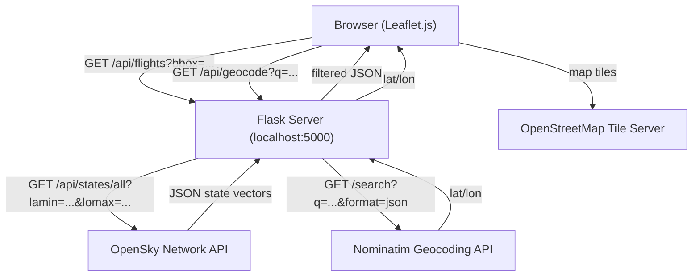
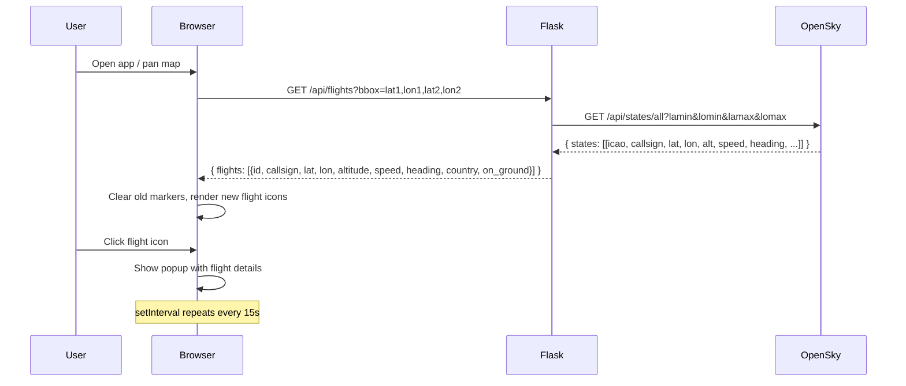

# Flight Tracker — Design

**Complexity: MEDIUM**

## Overview

A locally-run Python/Flask web app that proxies OpenSky Network flight data to a browser-based Leaflet.js map. The backend exists primarily to handle CORS and rate limiting; the frontend owns map rendering and interaction. No database — all data is ephemeral, fetched on demand.

---

## High Level Design





---

## Tech Stack

| Layer | Choice | Reason |
|---|---|---|
| Backend | Python + Flask | Minimal, local, no overhead. Fits a single-file proxy. |
| Map library | Leaflet.js (CDN) | Open-source, battle-tested, no API key. |
| Map tiles | OpenStreetMap via Leaflet | Free, no key, globally available. |
| Flight data | OpenSky Network REST API | Free, no auth for anonymous use, real-time ADS-B data. |
| Geocoding | Nominatim (OSM) | Free, no key, covers city/airport names. |
| Frontend build | None (vanilla JS) | App is simple enough; no bundler needed. |

---

## Data Model

No persistence layer. All data lives in memory for the duration of a request.

### OpenSky State Vector (raw, relevant fields)

| Index | Field | Type | Description |
|---|---|---|---|
| 0 | `icao24` | string | Unique ICAO transponder address |
| 1 | `callsign` | string | Flight identifier (may be empty) |
| 2 | `origin_country` | string | Country of registration |
| 5 | `longitude` | float | Current longitude |
| 6 | `latitude` | float | Current latitude |
| 7 | `baro_altitude` | float | Barometric altitude in meters |
| 9 | `velocity` | float | Speed over ground in m/s |
| 10 | `true_track` | float | Heading in degrees (0 = North) |
| 8 | `on_ground` | bool | Whether aircraft is on ground |

### Normalized Flight Object (sent to frontend)

```json
{
  "id": "abc123",
  "callsign": "UAL123",
  "country": "United States",
  "lat": 37.62,
  "lon": -122.38,
  "altitude": 10500,
  "speed": 245,
  "heading": 270,
  "on_ground": false
}
```

---

## API Design

### `GET /api/flights`

Fetches live flights within a bounding box.

**Query params:**

| Param | Type | Description |
|---|---|---|
| `lat1` | float | South latitude boundary |
| `lon1` | float | West longitude boundary |
| `lat2` | float | North latitude boundary |
| `lon2` | float | East longitude boundary |

**Bounding box guard:** If the bounding box area exceeds ~25 degrees² (user too zoomed out), return a `429`-style response prompting the user to zoom in.

**Response (200):**
```json
{
  "flights": [ { ...flight object... } ],
  "count": 12,
  "timestamp": 1713800000
}
```

**Response (zoom guard):**
```json
{ "error": "zoom_required", "message": "Zoom in to see flights." }
```

**Response (API error):**
```json
{ "error": "upstream_error", "message": "OpenSky API unavailable." }
```

---

### `GET /api/geocode`

Converts a location name to lat/lon for map navigation.

**Query params:**

| Param | Type | Description |
|---|---|---|
| `q` | string | Location name (e.g. "London", "JFK") |

**Response (200):**
```json
{ "lat": 51.5074, "lon": -0.1278, "display_name": "London, England" }
```

**Response (not found):**
```json
{ "error": "not_found", "message": "Location not found." }
```

---

## UI/UX Design

### Layout

```
┌─────────────────────────────────────────────────────────┐
│  [ Search: city or airport... ] [Go]   [↺ Refresh]      │  ← top bar
│  Flight count: 24 flights in view    Last updated: 12s   │
├─────────────────────────────────────────────────────────┤
│                                                          │
│                   LEAFLET MAP                            │
│         (full screen, pan/zoom freely)                   │
│                                                          │
│    ✈  ✈     ✈                                           │
│         ✈                                                │
│                    ✈  ✈                                  │
│                                                          │
└─────────────────────────────────────────────────────────┘
```

### Flight Icon
- Rotated airplane SVG icon, angle = heading degrees
- Color: blue for airborne, gray for on-ground
- Size: 24×24px, scales slightly on hover

### Popup (click on icon)
```
┌────────────────────┐
│ ✈ UAL123           │
│ Country: USA        │
│ Altitude: 10,500 m  │
│ Speed: 245 m/s      │
│ Heading: 270°       │
│ Status: Airborne    │
└────────────────────┘
```

### States
- **Loading**: spinner overlay on map during fetch
- **No flights**: toast message "No flights in this area"
- **Zoom required**: toast message "Zoom in to see flights"
- **API error**: red banner "Flight data unavailable — showing last known positions"
- **Auto-refresh**: countdown timer shown in status bar ("Refreshing in 8s...")

---

## Rate Limiting Strategy

OpenSky anonymous API: max 1 request per 10 seconds, 400 API credits per day.

- Flask tracks `last_fetch_time`; if a new request comes within 10 seconds of the last, return cached data.
- Cache is a simple in-memory dict `{ bbox_key: (timestamp, data) }` — no Redis needed.
- Frontend auto-refresh is set to 15 seconds (safely above the 10s limit).
- Manual refresh button is disabled for 10 seconds after a fetch.

---

## File Structure

```
og-ft/
├── app.py                  # Flask app, API routes
├── static/
│   ├── map.js              # Leaflet init, marker management, auto-refresh
│   ├── style.css           # Layout and UI polish
│   └── icons/
│       └── plane.svg       # Airplane icon (rotatable SVG)
├── templates/
│   └── index.html          # Single HTML page, loads Leaflet from CDN
├── requirements.txt
├── specs/
│   └── flight-tracker/
│       ├── requirements.md
│       └── design.md
└── README.md
```

---

## Summary

**Key decisions:**
- **Flask proxy** over direct browser calls: avoids CORS issues with OpenSky and lets us own rate limiting server-side.
- **Vanilla JS** over React/Vue: the UI is a map with markers — no component tree needed, no build step, faster iteration.
- **No database**: flight positions are real-time ephemeral data. Caching lives in a Python dict for the duration of the server process.
- **Bounding box guard** prevents hammering the API when the user is fully zoomed out. Threshold of ~25 degrees² keeps result sets manageable (roughly a country-sized view).
- **Nominatim** for geocoding: free, no key, good enough for city/airport name searches.
